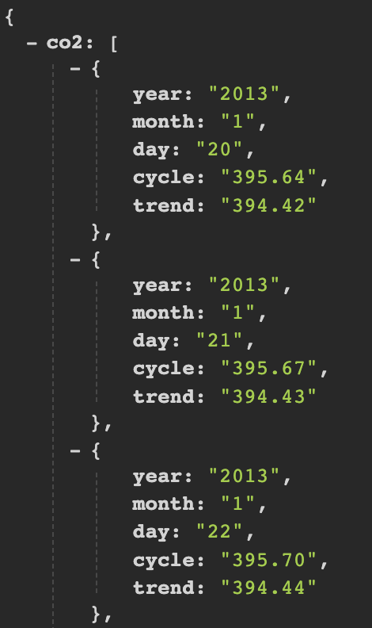

# Measuring CO2 Emission

You are working at a Climate Tech startup. You are tasked with creating a presentation for your client showing historical CO2 emission trends.

## JSON

JSON stands for "JavaScript Object Notation." 
It is a data format that is organized **hierarchically**, which means that values can be nested under each other. This nested structure may require the user to have more or less information to access different values within the file. 

JSON is a popular way to store data on the web, and it is similar to XML. 

Each object in JSON can contain multiple **key-value** pairs or other objects, which in turn can have their own key-value pairs or other objects nested within them. T

The values recorded for different objects can vary. The JSON file is represented using curly brackets and can be visualized as a set of boxes, but the actual JSON data is contained within the brackets.



## CSV

CSV stands for "Comma Separated Values." It is a simple file format that stores data in a tabular format. Each row in the file represents a record, and each column represents a field in the record. The values in each row are separated by commas, hence the name.

CSV files are widely used for storing and exchanging data between different software applications, especially for importing and exporting data into spreadsheets or databases. They are easy to create and edit using any text editor or spreadsheet software, and are compatible with almost all programming languages.

While CSV files are simple to read and understand, they have some limitations compared to more structured data formats like JSON or XML. For example, CSV files do not support nested structures or complex data types, which can make it challenging to represent certain types of data. However, for basic tabular data, CSV files provide a straightforward and flexible format for storing and exchanging data.


## Your Task

You will write program to do the following:

1. Fetch data from [Global-Warming.org](https://global-warming.org/)'s CO2 API.
This API provides on a quasi-daily basis, the amount of carbon dioxide (CO2) in the atmosphere from 2010.01.01 to the present. It is expressed as a mole fraction in dry air, parts per million (ppm). Fetch this endpoint https://global-warming.org/api/co2-api and you will get the info in JSON format.

2. You will parse the JSON response from the API and store the data in a CSV.

3. Create a visualization using the data in the CSV

## Starter Code

The starter code in `get_data.py` let's you call the API and get the response as JSON.

Quiz:
What is the root element of this JSON?

## Expected Results

1. A CSV with data in the following form
```
year,month,day,cycle,trend
2013,1,20,395.64,394.42
2013,1,21,395.67,394.43
2013,1,22,395.70,394.44
2013,1,23,395.72,394.44
```

2. A Line graph showing mean montly temperature for the last decade. 
